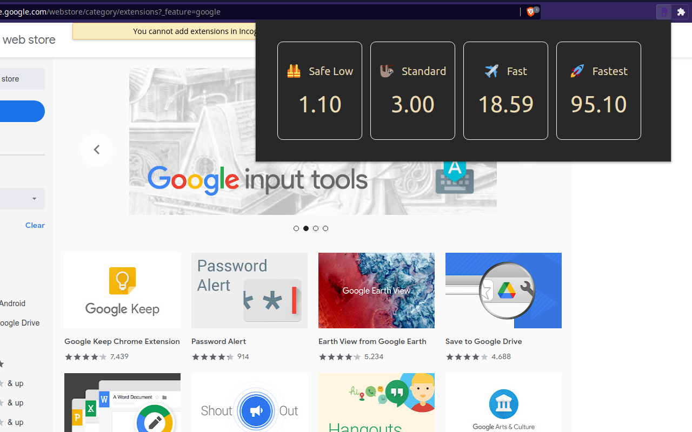

# Polygon Gas Station Extension

#### Simple extension for viewing current gas prices on Polygon mainnet



## How to download the extension from here?

First open the terminal and run
```bash
$ git clone https://github.com/Dornat/polygon-gas-station-extension.git
```

Go into the folder
```bash
$ cd polygon-gas-station-extension
```

Then build the project, run
```bash
$ yarn build
```

All the files that needed to run the extension are now in `dist` folder.

Now go to any chromium based browser (Chromium, Google Chrome, Brave) and open Settings -> Extensions.
Now click `Load Unpacked` and choose the `dist` folder that was created after `yarn build`.
*Developer mode maybe needed in order to load unpacked extension*.

## Available Scripts

In the project directory, you can run:

### `yarn start`

Runs the app in the development mode.\
Open [http://localhost:3000](http://localhost:3000) to view it in the browser.

### `yarn test`

Launches the test runner in the interactive watch mode.\
See the section about [running tests](https://facebook.github.io/create-react-app/docs/running-tests) for more information.

### `yarn build`

Builds the app for production and puts all files into `dist` folder.

### `yarn build:zip`

Builds zip archive using files from `dist` folder.
